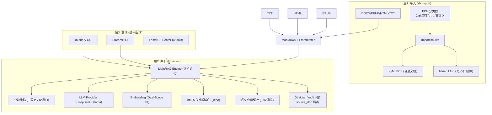

# kb-rag: 个人知识库引擎 · AI 驱动的结构化知识图谱

> **一句话**：把 PDF / Word / EPUB / HTML 文档扔进来，通过 LLM 自动提取实体与关系，构建可自然语言检索的知识图谱。支持 Obsidian 双链笔记、MCP 直连 Claude/Cursor、Streamlit 可视化浏览。

**项目定位**：不是又一个 naive RAG 玩具，而是为**个人开发者 / 小团队**设计的生产级知识库流水线。核心解决「异构文档解析 → 精准实体抽取 → 高质量混合检索 → 多端访问」全链路问题，已在哲学著作、学术论文、小说等多场景验证。

当前已实现三层管道 + 智能 PDF 路由 + 混合检索（向量 + BM25 + RRF） + 语义缓存 + Obsidian 实体隔离导出。**功能远不止眼前这些** —— 可视化检索路径、自适应分块策略、图谱前端画布、多模态扩展等正在规划与原型阶段。欢迎你一起定义和实现下一阶段。

[](https://www.python.org/) [](https://github.com/astral-sh/uv) [](https://github.com/HKUDS/LightRAG) [](https://opensource.org/licenses/MIT)

## 为什么选择 kb-rag 而不是直接用 LightRAG / LlamaIndex / AnythingLLM？

- **智能 PDF 分类与路由**（`importers/classifier.py` + `router.py`）：用 PyMuPDF 预扫描，统计**公式密度**（字符间距异常行比例 ≥2%）、**引用标记**（`[1]`, `et al.` 等正则命中 ≥3 条）、**学术关键词**（Abstract/Introduction/References）。自动决定走免费快速的 PyMuPDF 还是高精度 MinerU API（公式→LaTeX、表格→HTML、扫描件 OCR）。**底层逻辑**：避免了在数学/学术文档上 PyMuPDF 文本层缺失导致的实体召回率雪崩，也避免了全量 MinerU 的不必要 API 成本与延迟。

- **生产级混合检索 Pipeline**（`knowledge_graph/lightrag_engine.py`）：三段式 late fusion  
  1. LLM 理解问题并生成查询  
  2. LightRAG 向量检索（entities_vdb + relationships_vdb，低层+高层关键词） + jieba + BM25Okapi 关键词检索  
  3. **RRF (Reciprocal Rank Fusion)** 重排序（仅重排位置，不把 BM25 噪音块塞进 prompt）  
  **解决痛点**：纯向量容易丢“短引用块”，纯 BM25 容易把无关高频词块排前面导致 LLM 幻觉。RRF 让最相关的块排在 prompt 最前面，答案质量显著提升（见开发日志中“唐君毅六种理”案例）。

- **语义缓存 + 懒初始化**：查询 embedding 后 cosine similarity > 0.92（可配置）直接命中缓存（持久化到 `kb_data/query_cache.json`，LRU 淘汰最旧 1000 条）。同义问题（“六种理是什么” vs “六种理各有什么特点”）毫秒级返回。**LightRAG Engine 首次操作才初始化**，避免启动时大 VDB/KV 内存 allocate + 磁盘 I/O 峰值。

- **Obsidian 深度集成**：实体节点写入 `source_doc` 属性，按文档隔离导出为独立 Markdown + [[wikilink]] 双链。跨文档同名实体不会互相污染 vault。`--vault` 参数一键同步。

- **多接口统一后端**（同一 LightRAG 实例）：
  - `kb serve` → FastMCP Server（SSE，4 个 tools：query / list_documents / get_entities / get_document），完美对接 Claude Desktop / Cursor / Continue.dev
  - `kb ui` → Streamlit 4 页面（导入 / 检索 / 文档浏览 / 实体图谱）
  - `kb query` → CLI 极速测试

- **已血泪验证的鲁棒性**：修复过 embedding worker event loop closed（async/threading 混用经典坑）、Streamlit asyncio.Lock 跨事件循环失效、LLM 无超时卡死、jieba 首次加载卡顿、BM25 噪音注入等。**每一次修复都触及 GIL、事件循环绑定、缓存一致性等计算机底层原理**。

## 快速开始（5 分钟跑通）

```bash
# 1. 克隆 + 环境（推荐 uv，绝不要 pip）
git clone https://github.com/q1ngn1ng-web/kb-rag.git
cd kb-rag
uv python pin 3.12
uv sync
source .venv/bin/activate

# 2. 配置（推荐环境变量，绝不硬编码）
cp config.yaml.example config.yaml   # 可选，优先用 env
export DEEPSEEK_API_KEY="sk-..."
export DASHSCOPE_API_KEY="sk-..."    # text-embedding-v4
export MINERU_API_KEY="..."          # 如需处理论文/扫描件

# 3. 验证 LLM + Embedding 连通性
uv run python -m pytest tests/scripts/verify_llm.py -x -q

# 4. 导入文档（自动分类 + 转 Markdown）
kb import ./my_papers/                    # 仅转换
kb import --index ./my_papers/            # 转换 + 立即索引
kb import --vault ./my_vault ./my_books/  # 转换 + 索引 + 同步 Obsidian 实体笔记

# 5. 查询
kb query "唐君毅把理分为哪六种？各有什么特点？"
kb serve   # 启动 MCP Server，端口 8000
kb ui      # 启动 Streamlit 本地界面 http://localhost:8501
```

**推荐工作流**：先 `kb import --index` 一条龙 → `kb serve` 让 Claude 直接用你的知识库 → `kb ui` 可视化调试检索路径。

## 架构（三层管道）



**查询时三段式路径**（`mode=mix`）：
1. LLM 生成查询 → 向量检索实体/关系
2. jieba 分词 + BM25 关键词召回
3. RRF 融合重排序 → LLM 带上下文生成最终回答（带 `asyncio.wait_for` 超时保护）

## 配置说明

所有敏感信息优先从环境变量读取，`config.yaml` 仅作为默认值。

关键可调参数（`config.yaml` 或 env）：
- `knowledge_graph.chunk_size` / `chunk_overlap`：直接影响实体提取粒度与 prompt token 预算（哲学文本建议 1500-2500，叙事文本可更大）
- `knowledge_graph.cache_threshold`：默认 0.92（太高命中率低，太低误判）
- `pdf.routing`：公式密度阈值、引用阈值（可微调分类器）
- `llm.timeout`：单次 LLM 调用最长等待秒数

完整配置见 `config.yaml.example`。

## 示例与真实用例（预留位置，欢迎你来写）

我们故意在这里留出大片空白 —— 因为**最好的示例应该来自真实用户场景**。

### 示例 1：哲学著作多跳推理（强烈推荐）
- 数据：唐君毅《中国哲学原论》前六章
- 典型问题："唐君毅是如何区分这六种理的？" / "空理与性理的本质区别是什么？"
- 预期效果：RRF 让最相关的原文块排最前，LLM 给出带精确引用的结构化回答；第二次同义查询直接缓存命中（<1s）
- **待补充**：完整导入日志 + 查询日志 + 缓存命中截图 + Obsidian 实体笔记截图（欢迎 PR）

### 示例 2：学术论文公式 + 表格精确问答
- 数据：手势识别相关论文（含 YOLO 改进、SPP 公式等）
- 问题："HGDR-Net 的置信度公式和损失函数是什么？"
- 预期效果：MinerU 自动路由，公式保留 LaTeX，表格结构化，回答精准引用公式编号
- **待补充**：分类器命中日志 + 公式提取效果对比（PyMuPDF vs MinerU）

### 示例 3：小说人物关系图谱 + Obsidian 双链浏览
- 数据：任意长篇小说 EPUB
- 效果：人物、地点、事件实体自动提取，导出后在 Obsidian 里看到 [[叶文洁]] → [[三体]] 的双链网络
- **待补充**：不同 chunk 策略对叙事连贯性的影响实验

**邀请**：如果你有公开或自有测试文档（尤其是带 gold standard 实体/关系的），请提交到 `examples/` 或 `tests/fixtures/`，并附上复现命令。我们会把高质量案例放入 README。

## 测试、基准与质量门禁

当前测试入口：
```bash
pytest tests/ -q
uv run python -m pytest tests/scripts/verify_llm.py
```

**强烈欢迎贡献以下内容**（这些是项目当前最缺的，也是最有价值的方向）：

- 实体/关系抽取 F1 基准（建议用 HotpotQA dev.json 或自标注哲学/技术文档，建立 gold_standard）
- 检索质量消融实验：纯向量 vs BM25 vs RRF 的 recall@K / precision@K / 答案质量人工评分
- 分块策略 benchmark：不同 chunk_size / overlap / 策略（F vs R）对 cache hit rate、embedding 成本、最终答案质量的影响
- 并发安全测试：多线程 batch import + 并发 query 下的数据一致性、死锁、event loop 污染
- 端到端性能剖析：各阶段耗时 breakdown（分类器 / 分块 / LLM 实体提取 / embedding / RRF / LLM 回答）

所有新测试请遵循 `openspec/` 变更管理流程，并在 PR 中附上 benchmark 数据和火焰图（如果可能）。

## 路线图（远超当前实现）

项目正处于从“能跑”到“极致工程”的演进中。已完成 V3（BM25 仅排序 + 语义缓存 + 实体隔离），接下来计划：

- [ ] 文档类型自适应分块（哲学/技术小 chunk 保实体粒度，叙事大 chunk 保连贯性）
- [ ] 检索路径可视化 + 用户显式反馈闭环（“这个块有用” → 强化排序模型）
- [ ] 图谱可视化前端（Streamlit 或独立 Canvas）
- [ ] 更多 importer（PPTX、扫描件增强、Markdown 增强 frontmatter 处理）
- [ ] 本地优先支持（Ollama + BGE / text2vec，本地 embedding batch 内存优化）
- [ ] 增量更新与知识图谱版本化

**这些都不是空谈** —— 许多想法已散落在 `Individual-knowledge-base.md` 和 `openspec/changes/` 中，缺少的是实现者。

## 贡献指南（诚挚邀请）

这个项目**绝对不是一个人能做完的**。它涉及：

- 底层：内存局部性（chunk 设计）、缓存一致性（语义缓存 + RRF）、异步模型（event loop + threading 混用）、I/O 优化（懒初始化 + 批量 embedding）
- 中层：LLM prompt engineering（实体提取质量）、检索算法（RRF 权重调优）
- 上层：用户体验（Streamlit 页面、Obsidian 集成）、多格式解析鲁棒性

**无论你是**：
- 踩过无数 async / embedding worker 坑的资深 Python 工程师
- 对中文 LLM + 知识图谱有深刻理解的算法工程师
- 日常重度使用 Obsidian、想把知识库做到极致的 power user
- 想为个人/小团队知识管理贡献真实工具的开发者

**都欢迎加入**。

**如何开始贡献**：
1. 阅读 `AGENTS.md`、`onboarding.md`（仓库根目录）和 `Individual-knowledge-base.md` 了解演进历史与坑
2. 运行 `uv sync && pytest tests/`
3. 选一个你最有感觉的方向（示例、测试、某个 importer 优化、缓存策略调优等），开 issue 或直接 PR
4. 遵循 `openspec/` 工作流（/opsx:explore → /opsx:propose → /opsx:apply）

我们不接受“能跑就行”的 PR —— 每一处改动都必须能说清对 cache hit rate、token 效率、并发安全性、实体提取 precision 的影响。

## 致谢与历史

本项目从 nano-graphrag 实验起步，逐步演进到 LightRAG + 自定义混合检索 pipeline，踩过 event loop closed、缓存阈值误判、chunk 边界切断概念、BM25 噪音等无数坑。感谢所有在开发过程中直面这些底层问题的 commit。

特别感谢 LightRAG、MinerU、PyMuPDF、jieba、rank-bm25 等优秀开源项目。

## License

MIT License. 商业使用、修改、二次分发均欢迎，但请保留原作者署名。

---

**最后一句毒舌忠告**：

> 不要再造“能跑”的知识库轮子了。  
> 这个世界缺的是**在个人规模下依然把 cache locality、异步边界、检索融合、实体隔离这些计算机科学基本功做到极致**的工具。  
> kb-rag 正在往这个方向走。  
> **来，一起把这个轮子磨成钻石。**

有任何问题、idea、吐槽，欢迎开 issue 或直接 @ 项目维护者。让我们把个人知识库做到真正好用、真正专业、真正开放。

（本 README 为重构版，预留了大量示例与测试扩展位。原 README 过于简略，已无法承载项目当前的技术深度与社区邀请意图。）
