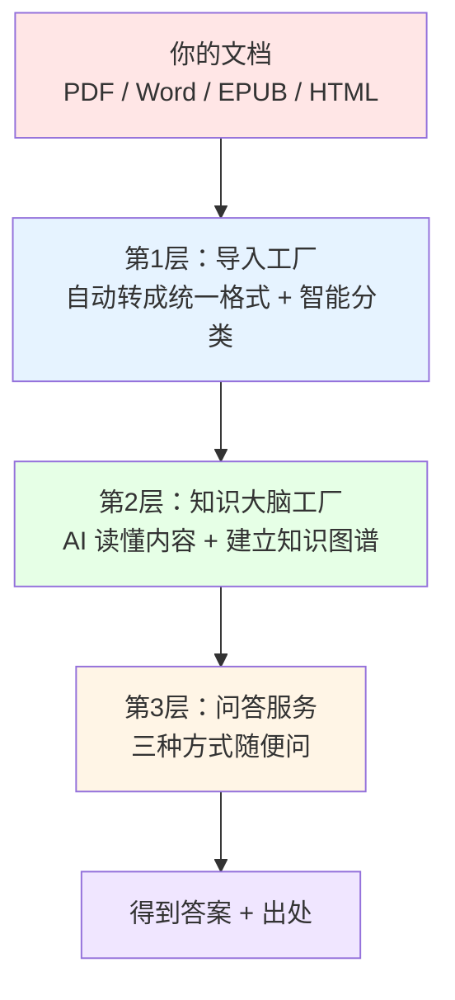

# 个人知识库项目 —— 给新手小白的上手指南（超直观图解版）

> **写给谁**：完全没接触过 AI 知识库、RAG、向量这些概念的小白。  
> **目标**：看完后你能**用自己的话**清楚地向别人解释这个项目是干什么的。  
> **特点**：大量简单直观的图 + 生活化语言，适合讲课或自学。

---

## 第一张图：你现在的烦恼

```
          你现在的状态
┌─────────────────────────────────────┐
│  一大堆 PDF、Word、电子书、网页笔记  │
│         ↓ 想找某个知识点             │
│  要手动翻几十上百页，效率极低        │
│  想问问题也只能自己慢慢找           │
└─────────────────────────────────────┘
```

很多人都有这个痛点：**资料太多，脑子记不住，找起来太麻烦**。

---

## 这个项目能帮你解决什么？（核心价值）

**一句话**：  
把你乱七八糟的文档，交给 AI 自动整理成一个**会自己思考的知识库**。以后你直接用**自然语言问问题**，它就能从你的资料里找到答案，还告诉你出处。

**真实效果对比**：

| 以前（手动找）               | 现在（用这个项目）                  |
|-----------------------------|------------------------------------|
| 翻几十个 PDF 找一句话        | 直接问问题，3-10 秒出答案 + 出处   |
| 资料之间关联全靠自己记       | AI 自动帮你建立知识之间的联系      |
| 新资料来了要重新整理         | 直接扔进去，知识库自动更新         |
| 想和别人分享知识很难         | 一键导出成 Obsidian 笔记或分享配置 |

---

## 第二张图：它是怎么工作的？（超级简化版）

整个项目就像一个**三层智能工厂**：



**每一层都用最简单的话解释：**

### 第1层：导入工厂（把乱七八糟的文档变成统一格式）
- 你扔给它各种文档
- 它自动判断：“这是普通文档还是带很多公式的论文？”
  - 普通文档 → 用最快的方式处理
  - 带公式的论文 → 自动用更强大的工具处理（保证公式和表格不丢）
- 最后所有文档都变成干净的 Markdown，放在一个文件夹里

**直观理解**：就像把各种格式的衣服统一收进同一个衣柜，并贴好标签。

### 第2层：知识大脑工厂（最核心的魔法）
这一步 AI 会做三件事：

1. **把长文档切成小卡片**（像把一本书拆成一张张知识卡片）
2. **仔细阅读每一张卡片**，找出里面的关键概念和它们之间的关系（比如“机器学习 → 包含 → 深度学习”）
3. **同时做两件事记住它们**：
   - 用“向量”技术记住每一段的意思（语义相近就能找到）
   - 用关键词技术记住重要词语

最后还会把结果缓存，下次问类似问题就非常快。

**直观理解**：AI 帮你把所有资料做成一张**超级思维导图 + 智能搜索引擎**。

### 第3层：问答服务（三种使用方式）

```mermaid
flowchart TD
    Start[开始] --> Step1[1. 安装一次环境<br/>uv sync]
    Step1 --> Step2[2. 配置两个免费密钥<br/>DeepSeek + 阿里云]
    Step2 --> Step3[3. 把文档放进文件夹<br/>扔给项目]
    Step3 --> Step4[4. 一行命令导入<br/>kb import --index ./我的文档/]
    Step4 --> Step5[5. 开始提问]
    Step5 --> Step5a[kb query "问题"<br/>或 kb ui]
    Step5a --> End[享受 AI 知识助手]
    
    style Start fill:#d4edda
    style End fill:#d4edda
```

- **浏览器界面**（最推荐）：输入 `kb ui`，浏览器打开就能用，像用微信一样简单
- **命令行**：输入 `kb query "你的问题"`，直接出答案
- **让 Claude 直接用**：运行 `kb serve`，然后在 Claude/Cursor 里配置一下，你的 AI 就能直接查你的知识库了

---

## 第三张图：真实使用流程（5 分钟上手）

```mermaid
flowchart TD
    Start[开始] --> Step1[1. 安装一次环境<br/>uv sync]
    Step1 --> Step2[2. 配置两个免费密钥<br/>DeepSeek + 阿里云]
    Step2 --> Step3[3. 把文档放进文件夹<br/>扔给项目]
    Step3 --> Step4[4. 一行命令导入<br/>kb import --index ./我的文档/]
    Step4 --> Step5[5. 开始提问]
    Step5 --> Step5a[kb query "问题"<br/>或 kb ui]
    Step5a --> End[享受 AI 知识助手]
    
    style Start fill:#d4edda
    style End fill:#d4edda
```

**最简单的新手路径**：
1. 安装环境（只做一次）
2. 申请两个免费密钥（复制粘贴）
3. 把你的文档放进一个文件夹
4. 运行一行命令：`kb import --index ./我的文档/`
5. 开始问问题！

---

## 第四张图：使用前后对比（强烈建议配真实截图）

**使用前**（混乱）：
- 几十个 PDF 散落在电脑里
- 想找知识要手动翻
- 资料之间没有关联

**使用后**（有序 + 智能）：
- 所有文档被自动整理
- 可以直接问问题
- AI 自动建立知识之间的联系
- 支持导出到 Obsidian 双链笔记

**建议你在这里放 2 张真实截图**（放在 `docs/images/` 文件夹）：

1. `streamlit-ui.png` — 浏览器界面的截图（让小白一看就知道有多简单）
2. `query-result-example.png` — 提问后得到答案 + 出处的截图

示例写法：
```markdown
**使用后的浏览器界面长这样：**


**提问后得到的结果（带出处）：**


```

---

## 小白最常问的 5 个问题

**Q1: 这个和直接问 ChatGPT 有什么区别？**  
A: ChatGPT 用的是它自己学到的知识，而这个项目**只用你自己的文档**来回答。你的资料更安全，也更精准。

**Q2: 我完全不会编程，能用吗？**  
A: 完全可以！新手最推荐用浏览器界面（`kb ui`），全程点鼠标就能用。

**Q3: 第一次导入要多久？**  
A: 取决于你文档的数量和电脑性能。几十个文档通常几分钟到十几分钟。之后查询就很快了。

**Q4: 答案不准怎么办？**  
A: 可以换一种问法，或者在浏览器界面里查看具体引用了哪些段落，自己验证。目前项目在持续优化准确率。

**Q5: 我可以把知识库分享给别人吗？**  
A: 可以！知识库就是一堆文件，你可以打包发给别人，或者部署到服务器。

---

## 给讲课/分享的人的小贴士

你可以直接这样讲：

“同学们，这个项目解决的核心问题就是**资料太多、找起来太麻烦**。

以前我们要把所有 PDF 翻一遍，现在把文档扔给它，它会自动帮我们做成一个**智能知识助手**。

你不用再手动整理，AI 会帮你建立知识之间的联系。

以后你想问任何问题，直接问它就行，它还能告诉你答案来自哪篇文档的哪一段。

整个过程分成三层：导入 → 建知识大脑 → 提问回答。

最推荐新手用浏览器界面，特别简单。”

---

## 想继续深入或贡献？

- 想看更详细的技术原理 → 可以再看进阶文档
- **非常欢迎你贡献**：
  - 给 `docs/images/` 文件夹加真实使用截图（这是最有价值的贡献！）
  - 写一个你自己真实场景的使用示例
  - 提 bug 或建议新功能

项目特别需要**真实使用场景的直观截图**，这对其他新手帮助最大。

---

**总结**：这份文档就是专门为小白设计的，配了大量直观流程图 + 对比表 + 截图占位。你可以直接拿去讲课、发给朋友、或作为项目介绍材料。

需要我再增加更多 mermaid 图、调整某个比喻、或者帮你生成概念图的图片描述（方便你用 AI 画图工具生成），随时说！