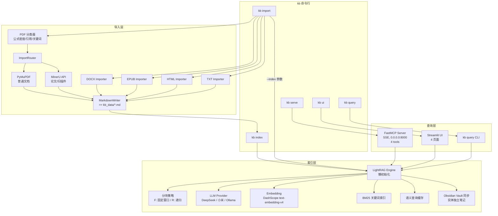
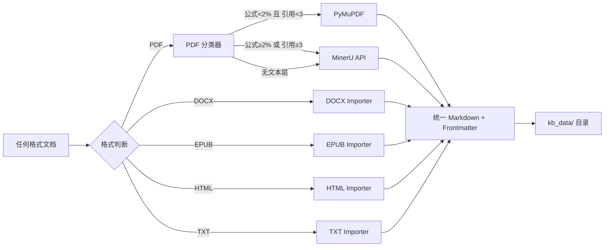
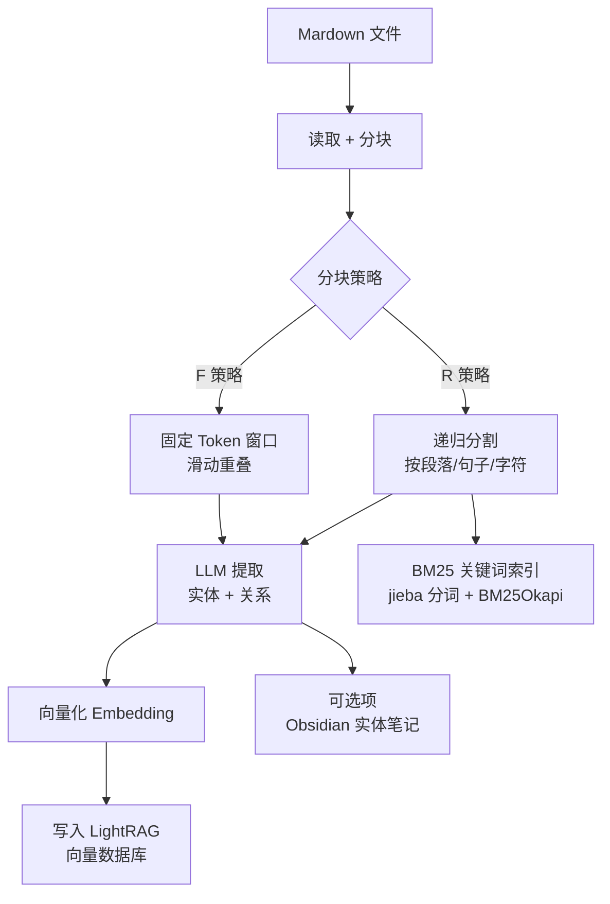
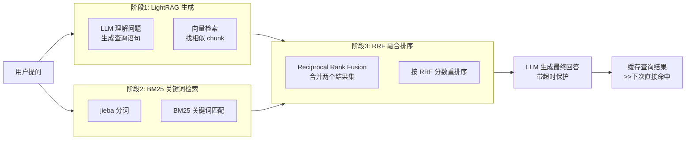

# 个人知识库项目 —— 新人上手指南

## 一句话

把你的 PDF / Word / EPUB / HTML 文档，通过 AI，变成可以自然语言检索的知识图谱。

## 项目概览

```
你有一堆文档（PDF/Word/EPUB/TXT/HTML）
         │
         ▼
   ┌─────────────────────────────────────┐
   │  层1：导入  (kb import)             │
   │  各种格式 → 统一 Markdown           │
   │  PDF 自动分类(普通/论文/扫描件)      │
   └─────────────────────────────────────┘
         │
         ▼
   ┌─────────────────────────────────────┐
   │  层2：索引  (kb index)              │
   │  Markdown → LightRAG 知识图谱       │
   │  LLM 提取实体+关系，向量化存储       │
   └─────────────────────────────────────┘
         │
         ▼
   ┌─────────────────────────────────────┐
   │  层3：查询                          │
   │  ┌───────┐ ┌────────┐ ┌──────────┐ │
   │  │MCP    │ │CLI     │ │Streamlit │ │
   │  │Server │ │kb query│ │UI        │ │
   │  └───────┘ └────────┘ └──────────┘ │
   │  自然语言提问，返回相关实体+段落     │
   └─────────────────────────────────────┘
```

---

## 架构图



---

## 三层管道详解

### 层1：导入（文档 → Markdown）



**PDF 分类器**（在 `importers/classifier.py`）：
- 用 PyMuPDF 预扫描 PDF
- 检测 **公式密度**（字符间距异常的行）
- 检测 **引用标记**（`[1]`, `[2,3]`, `et al.` 等）
- 检测 **学术关键词**（`Abstract`, `Introduction`, `References` 等）
- 公式 ≥ 2% 或引用 ≥ 3 条 → 判定为 **academic**，走 MinerU

### 层2：索引（Markdown → 知识图谱）



**查询时**（三段式检索）：


### 层3：查询接口

三种方式，同一后端：

| 方式 | 用途 | 启动命令 |
|------|------|---------|
| **MCP Server** | 主接口，让 Claude/Cursor 等 AI 工具直接查 | `kb serve` |
| **Streamlit UI** | 本地可视化浏览，4 个页面 | `kb ui` |
| **CLI** | 命令行快速查询 | `kb query "..."` |

MCP Server 提供 4 个 tools：
- `query(question, mode)` — 自然语言检索
- `list_documents()` — 查看已导入的文档
- `get_entities(doc_id)` — 查看文档中的实体
- `get_document(doc_id)` — 查看文档原文

---

## 目录结构速览

```
src/knowledge_base/
  cli.py                     # CLI 命令分发（import/index/serve/ui/query）
  config.py                  # 配置加载（YAML + 环境变量覆盖）
  exceptions.py              # 自定义异常层级
  logger.py                  # 日志设置
  obsidian.py                # Obsidian Vault 同步
  progress.py                # 进度条、计时器
  utils.py                   # 工具函数
  importers/                 # *** 导入子系统 ***
    __init__.py              # 导入器注册
    base.py                  # Importer 抽象基类 + ImportResult
    batch.py                 # 批量导入（多线程）
    classifier.py            # PDF 类型分类器（启发式）
    router.py                # PDF 路由（PyMuPDF 还是 MinerU）
    pymupdf_importer.py      # 普通 PDF → Markdown
    mineru_importer.py       # 论文/扫描件 → Markdown（API）
    docx_importer.py         # Word 文档 → Markdown
    epub_importer.py         # EPUB 电子书 → Markdown
    html_importer.py         # HTML 页面 → Markdown
    txt_importer.py          # 纯文本 → Markdown
    markdown_writer.py       # 统一 Markdown 写入（+ frontmatter）
  knowledge_graph/           # *** 知识图谱子系统 ***
    __init__.py              # 导出 engine + lightrag_engine
    engine.py                # KnowledgeGraphEngine 抽象接口
    lightrag_engine.py       # LightRAG 实现（662 行，核心）
    bm25_index.py            # BM25 关键词索引
    query_cache.py           # 语义查询缓存
  mcp_server/                # MCP 接口
    server.py                # FastMCP Server（4 tools, SSE）
  ui/                        # Streamlit 前端
    app.py                   # 4 页面（导入/检索/文档/实体）
```

---

## 开发环境

### 工具链

| 工具 | 用途 |
|------|------|
| **uv** | 包管理（**不要用 pip**） |
| Python 3.12 | 运行环境 |
| lightrag-hku | 核心知识图谱引擎 |
| FastMCP | MCP Server 框架 |
| Streamlit | 本地 UI |
| jieba | 中文分词（BM25 用） |
| rank-bm25 | 关键词检索 |

### 关键命令

```bash
uv sync                           # 安装依赖（配了清华源）
source .venv/bin/activate         # 激活虚拟环境
python scripts/verify_llm.py      # 验证 LLM + Embedding 连接
kb import ./test_data/            # 导入文档
kb index ./kb_data/               # 索引到知识图谱
kb query "机器学习是什么"          # 查询
kb serve                          # 启动 MCP Server
kb ui                             # 启动 Streamlit
pytest tests/                     # 运行测试
```

---

## 重要设计原则

1. **接口抽象** — 不要直接调用 LightRAG API，通过 `KnowledgeGraphEngine` 抽象接口操作
2. **配置分离** — 所有 API Key、URL、路径从 `config.yaml` / 环境变量读取，代码里不硬编码
3. **懒初始化** — LightRAG Engine 首次操作才加载，避免启动就报错
4. **PDF 自动路由** — 普通文档走 PyMuPDF（免费），论文扫描件自动升级到 MinerU API（更准）
5. **三段式查询** — LLM 向量检索 + BM25 关键词 + RRF 融合排序，互补优缺点
6. **语义缓存** — 相似问题直接命中缓存，省 token、省时间

---

## 一些概念解释

| 概念 | 说明 |
|------|------|
| **LightRAG** | 基于 LLM 的知识图谱引擎，从文档提取实体和关系，支持自然语言查询 |
| **实体** | 文档中的概念/名词，比如"机器学习"、"神经网络" |
| **关系** | 实体之间的关联，比如"机器学习 → 包含 → 深度学习" |
| **Chunk** | 文档被切成的段落块，是检索的基本单位 |
| **F 策略** | 固定 Token 窗口分块，按字数切 |
| **R 策略** | 递归分割，按层级（段落→句子→字符）切 |
| **RRF** | Reciprocal Rank Fusion，合并多个检索结果并重排序 |
| **BM25** | 关键词检索算法，跟搜索引擎原理一样 |
| **MCP** | Model Context Protocol，让 AI 工具调用外部工具的协议 |
| **MinerU** | PDF 解析引擎（API），能处理公式、表格、扫描件 |
| **Frontmatter** | Markdown 文件开头的 YAML 元数据（标题、来源、日期等） |
| **Obsidian Vault** | Obsidian 笔记软件的文件夹，支持 [[wikilink]] 链接 |

---

## Bug 文化

遇到异常先查 `docs/bugs.md`，历史 Bug 记录如下：

| Bug | 原因 | 解决 |
|-----|------|------|
| LightRAG 删除文档失败 | 方法名从 `delete_by_doc_id` 改成 `adelete_by_doc_id` | 加 `a` 前缀 |
| 语义缓存过于严格 | 阈值 0.95 太高 | 降到 0.92 |
| 缺少分块依赖 | R 策略需要 `langchain-text-splitters` | 加到依赖 |
| BM25 注入噪音 | 直接拼接 BM25 结果导致 LLM 幻觉 | 改为 RRF 重排序 |
| jieba 查询卡顿 | 首次使用才加载词典 | 初始化时预加载 |
| LLM 查询卡死 | 无超时保护，LLM 不返回就永远等 | 加 `asyncio.wait_for` 超时 |
| Streamlit 锁失效 | `asyncio.Lock` 跨事件循环不工作 | 替换锁实现 |
| 文档列表为空 | 读错文件路径 | 改读 `kv_store_full_docs.json` |
| uv 安装超时 | 默认源在国外 | 配清华镜像 |

---

## OpenSpec 工作流（项目用这个管理变更）

```
/opsx:explore    → 探索想法、澄清需求
/opsx:propose    → 生成完整变更提案（设计文档 + 任务列表）
/opsx:apply      → 按任务列表实现代码
/opsx:archive    → 归档已完成变更
/opsx:sync       → 增量文档 → 主文档同步
```

已完成的 5 个变更记录在 `openspec/changes/archive/`。

---

## 典型使用场景

**场景1：你有一堆 PDF 论文要建知识库**
```
kb import --index ./papers/     ← 一行命令搞定导入+索引
kb query "这篇论文用的什么方法"   ← 直接问
```

**场景2：你是 Claude/Cursor 用户**
```
(终端) kb serve                   ← 启动 MCP
(Claude) 配置 MCP 指向这个 server
(Claude) "从我的知识库查一下 XXX"  ← 直接在对话里查
```

**场景3：你想在浏览器里浏览知识库**
```
kb import ./books/ && kb index   ← 先建好
kb ui                            ← 打开浏览器
```

---

## 各文件功能详解

### 顶层文件

| 文件 | 行数 | 功能 |
|------|------|------|
| `__init__.py` | 3 | 包声明，版本号 `0.1.0` |
| `cli.py` | 293 | **CLI 入口**。`kb` 命令分发器：解析 argv → 调用 `_cmd_import` / `_cmd_index` / `_cmd_serve` / `_cmd_ui` / `_cmd_query` |
| `config.py` | 146 | **配置管理**。`load_config()` 加载 YAML + 深度合并默认配置 + 环境变量覆盖（API Key） |
| `exceptions.py` | 37 | **异常层级**。`KnowledgeBaseError` → `ConfigError` / `ImportError` / `KnowledgeGraphError` / `LLMConnectionError` / `MCPError` |
| `logger.py` | 53 | **日志设置**。`setup_logger()` 配置控制台+文件双输出 |
| `progress.py` | 94 | **进度条**。封装 tqdm + `Timer` 计时器 + `report_summary()` 摘要格式化 |
| `utils.py` | 115 | **工具函数**。`strip_frontmatter()` 剥离 YAML 头、`sanitize_filename()` 清理文件名、`unique_path()` 防冲突路径生成 |
| `obsidian.py` | 311 | **Obsidian Vault 同步**。生成含 frontmatter + [[wikilinks]] 的 md，文档文件夹隔离，实体独立笔记 |

### CLI 各命令流程

#### `cli.py:_cmd_import`（`kb import`）
```
用户输入: kb import [--index] [--vault] <path>
    │
    ├─ 1. 解析 flags（--index / --vault / --engine）
    ├─ 2. 创建 BatchImporter，输出到 kb_data/
    ├─ 3. 遍历路径：
    │      └─ importer.import_path(path)
    │            ├─ 文件 → import_file() 单文件处理
    │            └─ 目录 → import_directory() 多线程批量
    │
    ├─ 4. --index 时：对每个成功结果，读 md → strip_frontmatter → kg_engine.index_document()
    └─ 5. --vault 时：sync_to_obsidian()
```

#### `cli.py:_cmd_index`（`kb index`）
```
用户输入: kb index [--vault] [--force] <path>
    │
    ├─ 1. 收集 .md 文件（递归目录）
    ├─ 2. 逐个读取 → strip_frontmatter()
    ├─ 3. --force 时先 delete_document() 清理旧数据
    └─ 4. kg_engine.index_document() + --vault 时同步实体
```

#### `cli.py:_cmd_query`（`kb query`）
```
用户输入: kb query [--mode hybrid] "问题"
    │
    ├─ 1. 解析 --mode 参数
    ├─ 2. 初始化 LightRAGEngine
    └─ 3. kg_engine.query(question, mode) → 打印结果
```

---

### `importers/` 子系统 — 文档导入

```
importers/
  __init__.py         # 导入器注册总控，静默处理缺失依赖
  base.py             # Importer 抽象基类 + 注册模式
  batch.py            # 批量导入（ThreadPoolExecutor 多线程）
  classifier.py       # PDF 类型分类器
  router.py           # PDF 路由决策
  markdown_writer.py  # 统一 Markdown 写入（frontmatter + 图片）
  pymupdf_importer.py # 普通 PDF → Markdown（PyMuPDF）
  mineru_importer.py  # 论文/扫描件 → Markdown（MinerU API）
  docx_importer.py    # DOCX → Markdown
  epub_importer.py    # EPUB → Markdown
  html_importer.py    # HTML → Markdown
  txt_importer.py     # TXT → Markdown
```

#### `base.py` — 导入器注册模式
```python
class Importer(ABC):          # 抽象基类，子类实现 convert()
    extensions = []           # 声明支持的文件扩展名

@auto_register                # 装饰器：自动注册到全局映射
class PyMuPDFImporter(Importer):
    extensions = [".pdf"]

# 调用时通过文件扩展名查找
importer_cls = get_importer(".pdf")   # → PyMuPDFImporter
importer = importer_cls()
result = importer.convert(file_path)  # → ImportResult(markdown, metadata, images)
```

为什么这样设计？**插件式架构**：新增格式只需要写一个 Importer 子类，加 `@auto_register` 就行，其他地方不用改。

#### `classifier.py` — PDF 分类器（318 行）
```
convert(file_path)
    │
    ├─ 1. _check_scanned()     ← 检查有无文本层（前50页）
    │      └─ 无文本 → "scanned" (置信度 0.95)
    │
    ├─ 2. _extract_text()      ← 提取前10页文本
    │
    ├─ 3. _calculate_formula_density(text)
    │      └─ 统计：Unicode 数学符号 + LaTeX 环境 + $ 符号 / 总字符
    │
    ├─ 4. _count_citations(text)
    │      └─ 正则匹配 [1], [2,3], [1-3] 等引用模式
    │
    ├─ 5. _count_academic_keywords(text)
    │      └─ 匹配中英文学术语（Abstract、摘要、Theorem 等）
    │
    └─ 6. _decide() 综合判定：
           formula ≥ 2% 或 citations ≥ 3 或 keywords ≥ 2 → "academic"
           否则 → "simple"
```

#### `router.py` — PDF 路由决策（132 行）
```
route(file_path)
    │
    ├─ 配置 engine="pymupdf"/"mineru"? → 直接返回覆盖值
    ├─ auto=True? → 运行 classifier
    │     ├─ academic / scanned → "mineru"
    │     └─ simple → "pymupdf"
    └─ 默认 → "pymupdf"
```

#### `pymupdf_importer.py` — PyMuPDF 通道（323 行）

核心逻辑：
```
convert(file_path)
    │
    ├─ fitz.open() 打开 PDF
    ├─ 逐页 Page → Markdown
    │     ├─ _collect_spans()        ← 收集所有文本块
    │     ├─ _average_font_size()    ← 计算加权平均字体大小
    │     └─ _process_text_block()   ← 转换文本块
    │           ├─ _is_simple_table() → 检测表格
    │           ├─ 检测标题（字体 ≥ 平均 × 1.4）
    │           └─ _infer_heading_level() → 推断标题层级
    ├─ _strip_page_number()         ← 去除页码
    └─ 返回 ImportResult
```

关键特征：
- **字体检测标题**：不是看 PDF 标注的 Heading 标签，而是比平均字体大 1.4 倍 → 标题
- **简单表格检测**：多行 + 每行多个空格分隔列 + 列数一致 → Markdown 表格
- **页码剥离**：正则匹配独立页码行并移除

#### `mineru_importer.py` — MinerU API 通道（309 行）

适用于论文/扫描件，通过 REST API 调用 MinerU 服务：

```
convert(file_path)
    │
    ├─ _upload()
    │     └─ POST {api_url}/extract/task  → 返回 task_id
    │
    ├─ _poll(task_id)
    │     └─ 轮询 GET {api_url}/extract/task/{task_id}
    │           ├─ state="done" → _download_result(zip_url)
    │           ├─ state="failed" → 报错
    │           └─ 继续轮询（5秒间隔，timeout 300秒）
    │
    ├─ _download_result(task_data)
    │     └─ 下载 ZIP → 解压 → 提取 .md 文件
    │
    └─ _parse_result() → 返回 (markdown, images, metadata)
```

注意：MinerU v4 API 只接受文件 URL，不支持直接上传。本地 PDF 需要托管到公网可访问的 URL。

#### `docx_importer.py` — DOCX → Markdown（192 行）
```
convert(file_path)
    ├─ _extract_metadata()  ← 从 core_properties 读标题/作者
    ├─ _extract_images()    ← 从 rels 中提取图片
    └─ _convert_body()
          ├─ 按文档顺序遍历段落 + 表格
          ├─ 段落：检测 Heading 1~6 → #~######
          ├─ 列表：List Bullet → -, List Number → 1.
          ├─ 行内格式：粗体 → **, 斜体 → *
          └─ 表格：→ Markdown 表格
```

#### `epub_importer.py` — EPUB → Markdown（180 行）
```
convert(file_path)
    ├─ epub.read_epub() 打开
    ├─ _extract_metadata()  ← DC 元数据
    ├─ _extract_images()   ← ITEM_IMAGE
    └─ _convert_documents()
          ├─ 遍历 ITEM_DOCUMENT
          ├─ _collect_toc_titles()  ← 收集目录映射
          └─ _html_to_markdown()    ← HTML 片段 → Markdown
```

#### `html_importer.py` — HTML → Markdown（291 行）
```
convert(file_path)
    ├─ _decode()           ← 多编码尝试（UTF-8 → GBK → Shift_JIS）
    ├─ BeautifulSoup 解析
    ├─ _extract_metadata()  ← <title>, <meta>
    ├─ _extract_images()    ← 本地相对路径图片
    └─ _convert_body()
          └─ _process_children()  ← 递归处理 DOM
               ├─ h1~h6 → #~######
               ├─ p / ul / ol / blockquote / pre / hr
               └─ 行内：a → [text](url), strong → **, em → *
```

#### `txt_importer.py` — TXT → Markdown（79 行）

最简单的导入器：多编码尝试 → 文本直接包裹为 Markdown 段落。

#### `markdown_writer.py` — 统一写入器（124 行）
```
write_markdown(result, output_dir, source_path)
    ├─ generate_frontmatter()  ← 从 metadata 生成 YAML 头
    ├─ _unique_filename()      ← 防重名（加时间戳）
    ├─ 保存图片到 _assets/ 并重写引用路径
    └─ 写入 .md 文件（UTF-8）
```

这里有个设计细节：图片路径重写。EPUB/HTML 的图片路径可能是内嵌的 `images/foo.png`，写入时统一改为 `_assets/foo.png`。

#### `batch.py` — 批量导入（223 行）
```
import_path(path)
    ├─ 文件 → import_file() 单文件
    └─ 目录 → import_directory()
          ├─ rglob 收集所有支持格式
          └─ ThreadPoolExecutor 多线程并行
```

---

### `knowledge_graph/` 子系统 — 知识图谱

```
knowledge_graph/
  __init__.py          # 导出 engine + lightrag_engine
  engine.py            # KnowledgeGraphEngine 抽象接口（6 个方法）
  lightrag_engine.py   # LightRAG 实现（662 行，最核心）
  bm25_index.py        # BM25 关键词索引
  query_cache.py       # 语义查询缓存
```

#### `engine.py` — 抽象接口（86 行）

```python
class KnowledgeGraphEngine(ABC):
    def index_document(self, doc_id, content, metadata=None) -> int  # 索引文档
    def query(self, question, mode="hybrid") -> str                  # 查询
    def list_documents(self) -> list[dict]                           # 文档列表
    def get_entities(self, doc_id=None) -> list[dict]                # 实体列表
    def delete_document(self, doc_id) -> bool                        # 删除文档
    def export_json(self, output_path) -> Path                       # 导出
```

**重要：** 所有代码通过这个接口操作 LightRAG，不能直接调 LightRAG API。这样设计的目的是：
1. 未来可以换其他知识图谱引擎（比如 Neo4j）
2. LightRAG 的 API 变化不影响上层代码
3. 测试时可以用 mock 替换

#### `lightrag_engine.py` — LightRAG 实现（662 行，核心）

这是项目最复杂的文件，分几块理解：

**懒初始化（`_ensure_initialized()`）：**
```
首次调用 index_document / query 时：
    ├─ finalize_share_data()          ← 重置 LightRAG 共享状态
    ├─ 创建 openai.AsyncOpenAI 客户端  ← LLM 调用
    ├─ 创建 embedding_func            ← 向量化
    ├─ LightRAG(...) 实例化
    ├─ asyncio.run(initialize_storages())  ← 初始化存储
    └─ 替换 asyncio.Lock              ← 修复 Streamlit 事件循环问题
```

为什么 Streamlit 会出问题？每次页面 rerun 创建新事件循环，LightRAG 的 `asyncio.Lock` 绑定到旧循环 → 报错。解决方案是每次初始化前重置锁。

**索引文档（`index_document()`）：**
```
index_document(doc_id, content)
    ├─ F 策略 → self._rag.insert(content)     ← 固定 Token 窗口
    ├─ R 策略 → apipeline_enqueue_documents()  ← 递归分割
    └─ BM25 重建
```

**查询（`query()`）—— 三段式架构：**
```
query(question, mode)
    │
    ├─ ▸ 缓存预检
    │     └─ embedding 问题 → _query_cache.lookup() → 命中直接返回
    │
    ├─ ▸ 阶段 1: LightRAG 出 Prompt
    │     └─ only_need_prompt=True → 不调 LLM，只组装上下文
    │
    ├─ ▸ 阶段 2: BM25 RRF 重排序
    │     └─ _rerank_chunks_with_bm25()
    │           ├─ 从 prompt 中提取 Document Chunks
    │           ├─ BM25 打分
    │           └─ RRF(1/(k+向量排名) + 1/(k+BM25排名)) 融合
    │
    ├─ ▸ 阶段 3: LLM 生成回答
    │     └─ openai.chat.completions.create() + 超时保护
    │
    └─ ▸ 存入缓存
          └─ _query_cache.store()
```

理解 RRF 融合排序（Reciprocal Rank Fusion）：
```
RRF得分 = 1/(60 + 向量排名) + 1/(60 + BM25排名)

例子：某 chunk 向量排名第3，BM25排名第10
→ RRF = 1/63 + 1/70 ≈ 0.030

目的：两个检索方法都排在前面 → 高 RRF 分
      一个高分一个低分 → 中等分
      两个都低分 → 低分
```

**删除文档（`delete_document()`）：**
```
    ├─ asyncio.run(self._rag.adelete_by_doc_id(doc_id))
    ├─ 删除 kb_data/imports/ 下的 .md 文件
    └─ 重建 BM25 索引
```

**自定义实体词典（`set_entity_dict()`）：**
让 LLM 在提取实体时关注特定的专有名词，比如人名、产品名。

**别名解析（`resolve_aliases()`）：**
把 "py"、"Python" 统一替换为 "Python"（按名称长度降序防止子串替换）。

#### `bm25_index.py` — BM25 关键词索引（99 行）
```
ChineseBM25Index(working_dir)
    │
    ├─ __init__() → 尝试从 bm25_index.pkl 加载
    │
    ├─ rebuild()
    │     └─ 读 kv_store_text_chunks.json → jieba 分词 → BM25Okapi 训练 → 持久化
    │
    └─ search(query, top_k)
          └─ jieba.cut(query) → BM25.get_scores() → top_k 返回 [(chunk_id, score)]
```

#### `query_cache.py` — 语义缓存（119 行）
```
QueryCache(path, threshold=0.92)
    │
    ├─ lookup(embedding, mode)
    │     └─ 计算余弦相似度 → threshold 比较 → 返回缓存的回答
    │
    └─ store(question, embedding, mode, response)
          └─ 追加 → 超 max_entries 时淘汰最旧 → 写 JSON
```

---

### `mcp_server/` 子系统 — MCP 接口

#### `server.py` — FastMCP 服务器（146 行）

四个 tool：

| Tool | 参数 | 说明 |
|------|------|------|
| `query` | question, mode | 核心检索，调 LightRAGEngine.query() |
| `list_documents` | 无 | 调 LightRAGEngine.list_documents() |
| `get_entities` | doc_id (可选) | 调 LightRAGEngine.get_entities() |
| `get_document` | doc_id | 从 kb_data/ 读原始 .md 文件 |

启动方式：`kb serve` → `run_server("0.0.0.0", 8000)` → `mcp.run(transport="sse")`

MCP（Model Context Protocol）让 Claude/Cursor 等 AI 工具调用这些 tool 来查询知识库，就像调用函数一样。

---

### `ui/` 子系统 — Streamlit 界面

#### `app.py` — 四个页面（744 行）

| 页面 | 函数 | 功能 |
|------|------|------|
| 文档导入 | `_render_import_page()` | 单文件上传 / 批量目录导入 → 转换 → 索引 |
| 知识检索 | `_render_search_page()` | 自然语言查询 + mode 选择 + 实体高亮 |
| 文档列表 | `_render_document_list()` | 表格展示 + 详情查看 + 删除操作 |
| 实体浏览 | `_render_entity_browser()` | 类型筛选 + 详情 + 分页列表 |

Streamlit 特性注意：
- `@st.cache_resource` 缓存 `_get_engine()` 的 LightRAG 实例
- 每次交互都会 rerun 整个脚本，所以懒初始化要处理好事件循环
- 批量导入用 `st.progress()` 显示进度
